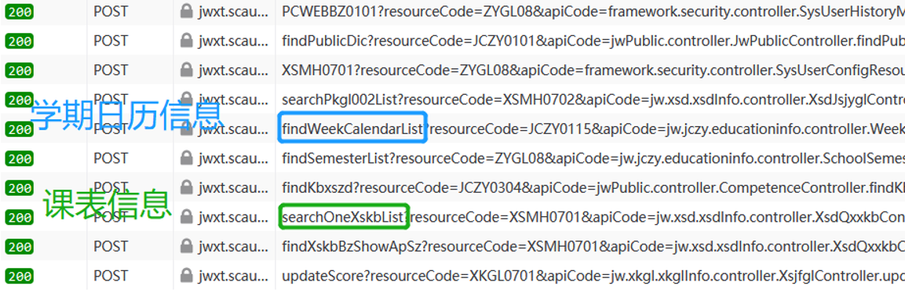
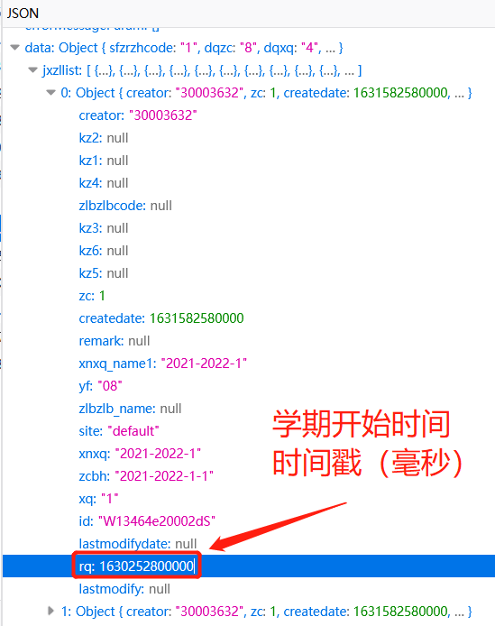
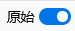
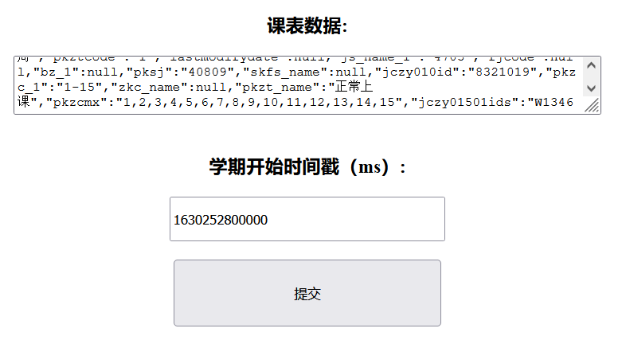
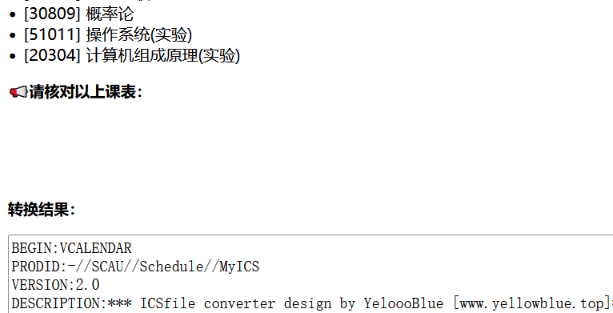

# SCAU教务系统课表转换ICS工具

## 简介

ICS文件很好用，转他！

[全自动转换](https://scau.yellowblue.top/ICS/)已经上线，欢迎体验

## 环境

- PHP 7.4        理论来说向下兼容，请自行测试
- 能登陆教务系统的网络

## 操作

### 第一步，登录教务系统

这个不用多说了吧

### 第二步，获取请求信息

1. 登陆后待主界面加载完毕
2. 打开开发者工具（一般按F12即可）
3. 切换到网络请求Network界面
4. 再点击教务系统中  我的选课 -> 个人课表

获取请求成功，我们只需要如下两个请求的Respond：

### 第三步，获取学期开始时间戳

1. 在学期日历请求（findWeekCalendarList）返回Respond的JSON中定位到

   `data -> jxzllist -> 0 -> rq`

   获取对应学期的开学时间戳

   *注：jxzllist中可获取到过去多个学期的开学时间，一般当前学期为第0个，具体学期参照 `xnxq`字段*

### 第四步，获取课表信息

直接复制学期日历请求（searchOneXskbList）中的***原始 JSON***

*以火狐浏览器为例，打开原始JSON的按钮即可*

### 第五步，打开index.html

输入刚刚获取到的信息即可

### 第六步，生成ICS文件

核对课表，获得结果

复制转换结果到记事本等编辑器，保存为`*.ics`后缀即可获得ICS文件

---

### 完成，开始使用你的ICS吧

